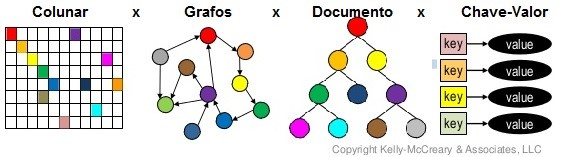
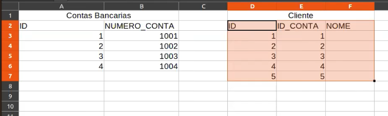

## 1 - O que é SQL e seus usos.

* SQL é sigla inglesa de "Structured Query Language" que significa, em Português, Linguagem de Consulta Estruturada.
* Utilizamos SQL para interagir com o nosso banco de dados, geralmente realizando operações de CRUD (Create, Read, Update and Delete).

### 1.1 Quais os tipos de bancos de dados existentes?

* Banco de dados relacional
    * No relacional, as informações se organizam em tabelas e dependem da integração entre colunas e linhas. São ideais quando há a necessidade de armazenar informações tabulares de pouca complexidade, e que precisam ser recuperadas e analisadas rapidamente.

    * Hoje os bancos de dados relacionais são os mais comuns no mercado, como em sistemas ERP e CRM, por exemplo. Tal popularidade é conquistada pela facilidade da armazenagem e pela confiabilidade das informações.

    * Por fim, uma outra característica importante é sua linguagem, que é baseada no SQL (Structured Query Language). É justamente por isso que a categoria relacional é considerada fácil, pois a inserção dos dados é fácil e recuperável. Vale ressaltar que a maioria dos tipos de banco de dados usam o SQL. 

* Banco de dados não relacionais
    * Já os não relacionais atendem a uma parcela de dados que não pode ser inserida e acessada por tabelas, como por exemplo, as imagens. Mas, por meio deles, não é necessário criar um sistema de relacionamento entre informações, como os bancos de dados relacionais. 

    * Como as informações não estão associadas entre si, fica mais fácil executar alterações e exclusões no conteúdo.

    * Nessa categoria encontramos bancos de Chave/Valor, Documentos, Grafos, entre outros.


<br/>
<br/>
<b>Imagem ilustrativa</b>
<h1>
    
</h1>

### 1.2 Quais os bancos de dados relacionais mais famosos?

* PostgreSQL
* Oracle
* SQL Server
* MySQL
* MariaDB

### 1.3 Meus primeiros passos com tabelas

* Tabelas são literalmente tabelas. Estruturas de linhas e colunas que tem a capacidade de salvar informações. Podemos fazer a analogia que uma tabela em um banco de dados é algo muito parecido a um arquivo excel. Onde nossas colunas são parecidos com o atributo de uma classe (POO) e nossas linhas são instâncias/objetos diferentes dessa classe (POO).


<h1 align="center">
    
</h1>


### 1.4 Meus primeiros scripts SQL

```sql
-- Criando uma tabela
create table contas(
    id integer,
    numero varchar
)
```

```sql
-- Inserindo dados na tabela
insert into contas (id, numero) values (1, '1001');
insert into contas (id, numero) values (2, '1002');
insert into contas (id, numero) values (3, '1003');
insert into contas (id, numero) values (4, '1004');
```

```sql
-- Alterando dados de um registro da tabela
update contas set numero = '4004' where id = 4;
```

```sql
-- Usando begin / rollback
begin;
update contas set numero = '8004' where id = 4;
rollback;
-- Rodando o código dessa forma não vamos alterar o valor do nosso registro de id 4, pois estamos desfazendo tudo que está dentro do bloco begin / rollback
```

```sql
-- Usando begin / commit
begin;
update contas set numero = '8004' where id = 4;
commit;
-- Dessa forma iremos alterar o valor do numero do registro/linha de id 4, pois ao final do bloco begin, estamos rodando o comando commit
```

## 2 - Assuntos importante do Java

### 2.1 Estruturas de dados novas

#### 2.1.1 List

* Listas são estruturas de dados muito parecidas com arrays que permitem a inserção de vários itens de determinado tipo.

* Na lista abaixo vamos inserir vários itens do tipo Integer.

```java
// LISTA
System.out.println("LISTA");

List<Integer> lista = new ArrayList<Integer>();
lista.add(1);
lista.add(2);
lista.add(3);
lista.add(4);
lista.add(1);
lista.add(2);
lista.add(3);
lista.add(4);

for (Integer item : lista) {
    System.out.println(item);
}

System.out.println(lista.get(0));
/*
***Resultado do for***
1
2
3
4
1
2
3
4
***Resultado do acesso por índice***
1
*/
```

* Outra característica da lista é que podemos acessar os seu itens através do índice.

* Além disso toda lista inicia no índice 0.

#### 2.1.2 Set

* Sets são estruturas de dados conhecidas por aceitar apenas valores únicos, ou seja, qualquer valor duplicado não será inserido no set.

* O set mantém sempre a referência para o primeiro objeto de mesmo valor. Imagine que você tem dois Inteiros com o mesmo valor 1050. O primeiro Inteiro tem o endereço de memória YXZ e o segundo Inteiro aponta para ABC. a inserir os dois no Set na sequência YXZ, ABC, o Set irá apontar para o primeiro objeto YXZ.

* Algumas implementações de Set não garantem ordem dos dados.

* Para objetos próprios inseridos no Set, temos que garantir que o método equals e hashCode estejam corretamente implementados.

```java
// Objeto próprio utilizado no código SET
// Equals e HashCode
public class Pessoa {

	private String nome;
	private String cpf;

	Pessoa(String nome, String cpf) {
		this.nome = nome;
		this.cpf = cpf;
	}

	public String getNome() {
		return nome;
	}

	public void setNome(String nome) {
		this.nome = nome;
	}

	public String getCpf() {
		return cpf;
	}

	public void setCpf(String cpf) {
		this.cpf = cpf;
	}

	@Override
	public String toString() {
		// TODO Auto-generated method stub
		return "Nome: " + this.nome + " CPF: " + this.cpf;
	}

	@Override
	public int hashCode() {
		final int prime = 31;
		int result = 1;
		result = prime * result + ((cpf == null) ? 0 : cpf.hashCode());
		return result;
	}

	@Override
	public boolean equals(Object obj) {
		if (this == obj)
			return true;
		if (obj == null)
			return false;
		if (getClass() != obj.getClass())
			return false;
		Pessoa other = (Pessoa) obj;
		if (cpf == null) {
			if (other.cpf != null)
				return false;
		} else if (!cpf.equals(other.cpf))
			return false;
		return true;
	}

}
```

```java
// SET
System.out.println("SET");

Set<Integer> listaSemRepeticoes = new HashSet<Integer>();

listaSemRepeticoes.add(1);
listaSemRepeticoes.add(2);
listaSemRepeticoes.add(3);
listaSemRepeticoes.add(4);
listaSemRepeticoes.add(1);
listaSemRepeticoes.add(2);
listaSemRepeticoes.add(3);
listaSemRepeticoes.add(4);

for (Integer item : listaSemRepeticoes) {
    System.out.println(item);
}

// SET COM OBJETO PRÓPRIO

System.out.println("Set Objeto Próprio");

Set<Pessoa> listaPessoasSemRepeticao = new HashSet<Pessoa>();
Pessoa pessoa1 = new Pessoa("Anderson Rocha", "111.111.111-11");
Pessoa pessoa2 = new Pessoa("Anderson Rocha", "111.111.111-11");
Pessoa pessoa3 = new Pessoa("Julio Reis", "111.111.111-11");

listaPessoasSemRepeticao.add(pessoa1);
listaPessoasSemRepeticao.add(pessoa2);
listaPessoasSemRepeticao.add(pessoa3);

for (Pessoa pessoa : listaPessoasSemRepeticao) {
    System.out.println(pessoa);
}
/*
***Resultado Set Integer***
1
2
3
4
***Resultado Set Pessoa***
***Set Objeto Próprio***
Nome: Anderson Rocha CPF: 111.111.111-11
*/
```

#### 2.1.3 Map

* Mapas são estruturas de chave e valor, ou seja, cada elemento de sua lista possui uma chave e valor associado, assim podemos realizar uma busca rápida pela chave que desejamos, sem precisar percorrer toda lista ou saber o index/posição que desejamos consultar.

* Diferente do SET, o mapa sempre considera o último valor atualizado na sua chave. O Set sempre considera a primeira referência, como visto anteriormente.

```java
// MAP / HASHMAP

// chave id
// valor 1000

// chave data da transacao do extrato
// valor valor da transacao

System.out.println("MAPA");

Map<Integer, String> meuMapa = new HashMap<Integer, String>();
meuMapa.put(1, "Anderson");
meuMapa.put(2, "Thais");
meuMapa.put(3, "Cyntia");
meuMapa.put(4, "Diego");
meuMapa.put(5, "Ana");
meuMapa.put(6, "Laiane");
meuMapa.put(6, "Tamiris");

for (String valor : meuMapa.values()) {
    System.out.println(valor);
}

for (Integer chave : meuMapa.keySet()) {
    System.out.println(chave);
}

System.out.println("Printando chave e valor modo 1");
for (Entry<Integer, String> chaveValor : meuMapa.entrySet()) {
    System.out.println("chave: " + chaveValor.getKey() + " valor: " + chaveValor.getValue());
}

System.out.println("Printando chave e valor modo 2");
for (Integer chave : meuMapa.keySet()) {
    String valor = meuMapa.get(chave);
    System.out.println("chave: " + chave + " valor: " + valor);
}

System.out.println("Printando chave e valor com lambda");
meuMapa.forEach((k, v) -> {
    System.out.println("chave: " + k + " valor: " + v);
});

/*
***Printando chave e valor modo 1***
chave: 1 valor: Anderson
chave: 2 valor: Thais
chave: 3 valor: Cyntia
chave: 4 valor: Diego
chave: 5 valor: Ana
chave: 6 valor: Tamiris
***Printando chave e valor modo 2***
chave: 1 valor: Anderson
chave: 2 valor: Thais
chave: 3 valor: Cyntia
chave: 4 valor: Diego
chave: 5 valor: Ana
chave: 6 valor: Tamiris
***Printando chave e valor com lambda***
chave: 1 valor: Anderson
chave: 2 valor: Thais
chave: 3 valor: Cyntia
chave: 4 valor: Diego
chave: 5 valor: Ana
chave: 6 valor: Tamiris
*/
```

* Tanto a chave quanto o valor são Objetos do Java. Você pode usar objetos próprios, objetos wrappers, objetos de bibliotecas de terceiros, etc.


### 2.2 Wrappers, Autoboxing, Boxing, Unboxing 

#### 2.2.1 Wrappers

* Wrappers vem do verbo inglês "wrap" que significa envolver. Eles são um nome adicional ao padrão de projeto Decorator. Tem como principal função "envolver coisas" adicionando funcionalidades à ela.

* O Java conta com diversos Wrappers que adicionam funcionalidades a outras classes ou tipos primitivos, um exemplo dele é o Integer, que é o Wrapper do tipo primitivo int. Que tipo de funcionalidade você pode executar tendo apenas uma variável definida como "int"? Nenhuma, a não ser atribuir valores, pois int é um tipo primitivo e não possuí métodos.

#### 2.2.2 Autoboxing com Wrappers

* Após o Java 5 surgiu a funcionalidade do Autoboxing onde o próprio Java já converte o tipo primitivo em Wrapper se este achar que é necessário. Veja o exemplo abaixo com Autoboxing funcionando.

```java
// Sem Autoboxing
HashMap hashMap = new HashMap();
hashMap.put(new Integer(10), "Carlos");
hashMap.put(new Integer(11), "Jose");
hashMap.put(new Integer(12), "Pedro");
```

```java
// Com Autoboxing
HashMap hashMap = new HashMap();
hashMap.put(10, "Carlos");
hashMap.put(11, "Jose");
hashMap.put(12, "Pedro");
```

#### 2.2.3 Boxing Conversion

* O Boxing é a conversão de tipos primitivos em seu respectivo Wrapper correspondente

```java
Boolean meuBoolean = true;
Integer meuInteger = 1203;
Double meuDouble = 10.20;
```

#### 2.2.4 Unboxing Conversion

* O Unboxing Conversion é quando você deseja fazer o inverso, ou seja, deseja converter um objeto para um tipo primitivo

```java
boolean aaa = new Boolean("True");
char ccc = new Character('c');
byte bbb = new Byte("1");
float fff = new Float(1.0f);
```

#### 2.2.5 Comparando Wrappers

* Possivelmente você já deve ter comparado Strings em Java, e deve saber que utilizar o operador “==” não funciona, é por isso que a implementação no método equals e hashCode nas suas classes são muito importantes. Com os Wrappers você também deve utilizar o método equals para realizar estes tipos de comparações, não esqueça que Wrappers são objetos e não tipos primitivos.


## 3 - Links e Livros para estudo

### 3.1 Tutoriais

* https://www.vogella.com/tutorials/JavaDatastructures/article.html

### 3.2 Livros

* https://www.ime.usp.br/~cosen/verao/alg.pdf
* Estruturas de dados e algoritmos em JAVA
* Estrutura de Dados e Técnicas de Programação

### 3.3 Vídeos/Cursos no YouTube

* https://www.youtube.com/playlist?list=PLGxZ4Rq3BOBrgumpzz-l8kFMw2DLERdxi