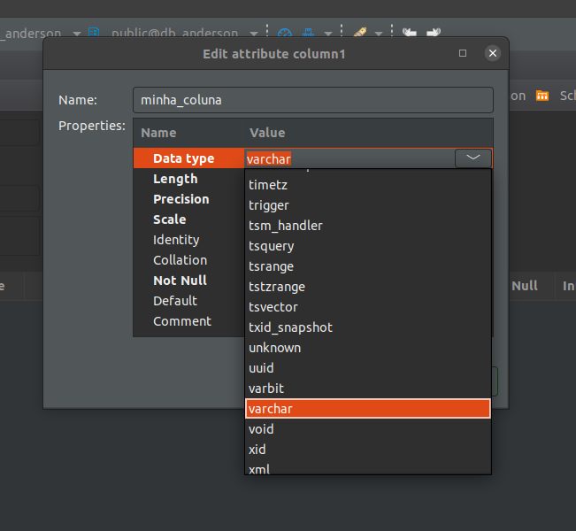
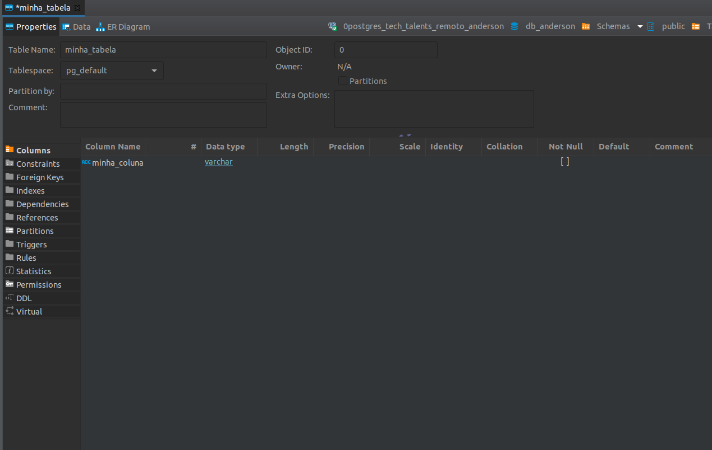

## 1 - Configurando o banco de dados no DBeaver


* No DBeaver vá em **File -> New**;
* Procure por Database Connection;
* Clique em next;
* Procure por PostgreSQL;
* Selecione o PostgreSQL (Símbolo de um elefante);
* Clique em next;
* Preencha os dados;
    * HOST -> meu.host.com
    * PORT -> 5432
    * DATABASE -> meu_banco
    * USERNAME -> meu_user
    * PASS -> Minha_Senha!

<h1 align="center">
    
</h1>
<h1 align="center">
    
</h1>
<h1 align="center">
    
</h1>
<h1 align="center">
    
</h1>


## 2 - Tabelas e colunas.

### 2.1 Criando minha primeira tabela usando a IDE

* No DBeaver navegue até o seu banco de dados;
* Expanda os sub-menus até chegar em public/Tables;
* Clique com o direito em cima de **Tables**;
* Selecione Create New Table (Criar Nova Tabela);
* Defina os dados das suas colunas;
* Clique em Save no canto inferior direito;
* Clique em Persiste na tela que mostrará o Script;

<h1 align="center">
    
</h1>
<h1 align="center">
    
</h1>
<h1 align="center">
    
</h1>
<h1 align="center">
    
</h1>
<h1 align="center">
    
</h1>
<h1 align="center">
    
</h1>
<h1 align="center">
    
</h1>
<h1 align="center">
    
</h1>
<h1 align="center">
    
</h1>
<h1 align="center">
    
</h1>
<h1 align="center">
    
</h1>
<h1 align="center">
    
</h1>
<h1 align="center">
    
</h1>
<h1 align="center">
    
</h1>
<h1 align="center">
    
</h1>

### 2.2 Criando minha primeira tabela através de um SCRIPT

```sql
create table contas (
    id integer,
    numero varchar
)
```

### 2.3 Adicionando mais colunas a minha tabela

```sql
alter table contas add column digito varchar;
```

**OBS:** É possível criar novas colunas através da IDE (DBeaver).

### 2.4 Removendo colunas da minha tabela

```sql
-- Criando uma nova coluna chamada teste
alter table contas add column teste varchar;
-- Removendo a coluna teste
alter table contas drop column teste;
```

**OBS:** É possível remover colunas através da IDE (DBeaver).

### 2.5 Criando uma tabela a partir de uma outra tabela já existente

```sql
create table contas2
as select * from contas;
```

**OBS:** É possível copiar e colar uma tabela através da IDE (DBeaver).

## 3 - Exercícios

* Criar as seguintes tabelas:


|tb_empresa                            |||
|----------|---------|-------------------|
| codigo   | int     | primary key       |
| nome     | varchar | not null          |
| email    | varchar | unique & not null |
| telefone | varchar |                   |

<br/>
<br/>

|tb_aluno                           |||
|-------|---------|-------------------|
| ra    | int     | primary key       |
| nome  | varchar | not null          |
| idade | int     |                   |

<br/>
<br/>

|tb_conta                               |||
|-----------|---------|-------------------|
| id        | int     | primary key       |
| nome      | varchar | not null          |
| sobrenome | varchar | not null          |
| email     | varchar | not null & unique |
| username  | varchar | not null & unique |
| senha     | varchar | not null          |

<br/>
<br/>
<br/>

## 4 - Links e Livros para estudo

### 4.1 Tutoriais

* http://pythonclub.com.br/tutorial-postgresql.html
* https://jtemporal.com/brincando-com-postgresql/

### 4.2 Livros

* PostgreSQL: Up and Running: A Practical Guide to the Advanced Open Source Database
* Learning PostgreSQL 11: A beginner’s guide to building high-performance PostgreSQL database solutions, 3rd Edition

### 4.3 Vídeos/Cursos no YouTube

* https://www.youtube.com/playlist?list=PLWd_VnthxxLe660ABLFZH26CW3G-uQIv-
* https://www.youtube.com/playlist?list=PLHz_AreHm4dkBs-795Dsgvau_ekxg8g1r [Esse curso é de MySQL mas pode ser útil para aprender (SQL) e comandos que são comuns entre os bancos]

### 4.4 Cursos em outra plataformas

* https://www.udemy.com/course/bancos-de-dados-relacionais-basico-avancado/
* https://www.coursera.org/learn/intro-sql